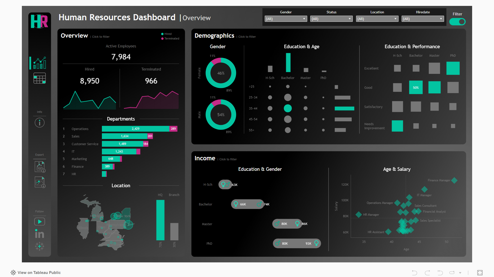

# tableau-business-analytics

# 📊 Strategic Business Analytics Portfolio

## 📖 Overview
This repository hosts a collection of interactive, production-ready dashboards designed to address common business analysis needs across HR and Sales domains.

Unlike standard static reports, these projects demonstrate **interactive exploratory and diagnostic analytics** designed to support decision-making, utilizing Tableau features such as filter-resilient calculations, dynamic parameters, and dashboard actions to enable stakeholder-driven analysis.

---

## 📂 Project 1: HR Intelligence & Attrition Monitor
**Domain:** People Analytics | **Role:** Analytics Engineer

### 🛑 The Business Problem
HR leadership relied on static, periodic reports that limited visibility into workforce composition and employee exit patterns, making it difficult to identify areas requiring retention focus. A more flexible, exploratory view was required to support proactive workforce planning.

### 💡 The Solution
Designed an interactive dashboard allowing HR Business Partners (HRBPs) to explore headcount and employee lifecycle data across multiple dimensions (tenure, age, gender, education, department) to surface workforce patterns and potential risk signals.

### 🛠️ Technical Implementation
* **Filter-Resilient Metrics:** Designed calculations and views to maintain metric consistency across user-applied filters and parameter selections.
* **Tenure Segmentation:** Structured views to explore employee tenure segments and highlight periods that may warrant closer retention attention.
* **Interactive Analysis:** Implemented dashboard actions and interactive filtering to enable drill-down analysis by department and employee attributes.

**Scope Note:**  
This dashboard focuses on exploratory workforce analytics and interaction design. It is intended to surface patterns and areas of interest rather than serve as a predictive attrition model.

  
  
  **[🔴 View Interactive Dashboard on Tableau Public] https://public.tableau.com/views/HRDashboard_17676890449090/HRSummary?:language=en-US&:sid=&:redirect=auth&:display_count=n&:origin=viz_share_link**

---

## 📂 Project 2: Sales Performance & Customer Analytics
**Domain:** Retail / CPG | **Role:** BI Developer

### 🛑 The Business Problem
Regional sales managers struggled to compare performance across time periods using fragmented Excel-based reporting. They needed a unified, interactive view to evaluate sales trends and customer contribution without repeated manual analysis.

### 💡 The Solution
A suite of parameterized dashboards focused on **Year-over-Year (YoY) comparison** and **customer-level analysis**, enabling users to dynamically explore performance across metrics, regions, and time periods.

### 🛠️ Technical Implementation
* **Parameter-Driven Analysis:** Implemented metric and year selection parameters to allow a single dashboard to support multiple analytical perspectives.
* **Advanced Filtering Logic:** Applied context-aware filtering to ensure accurate Top N and regional comparisons.
* **Optimized Data Structure:** Utilized a reporting-friendly data layout to support efficient aggregation and responsive dashboard performance.

### 📈 Analytical Observations
* Highlighted product categories exhibiting declining margins relative to revenue contribution.
* Identified concentration of revenue and profit among a limited subset of customers, supporting prioritization discussions.

  
  
  **[🔵 View Interactive Dashboard on Tableau Public] https://public.tableau.com/views/SalesCustomerDashboards_17676885678350/SalesDashboard?:language=en-US&:sid=&:redirect=auth&:display_count=n&:origin=viz_share_link**

---

## 🚀 How to Run
These dashboards are packaged as `.twbx` (Tableau Packaged Workbook) files.

1. Download the `.twbx` files from this repository.
2. Open using Tableau Desktop or the free [Tableau Reader](https://www.tableau.com/products/reader).
3. Alternatively, access the dashboards directly via the Tableau Public links above.

---

### 📬 Contact
* **Portfolio:** https://laksh-shardul.github.io/
* **Email:** lakshshardul@gmail.com
